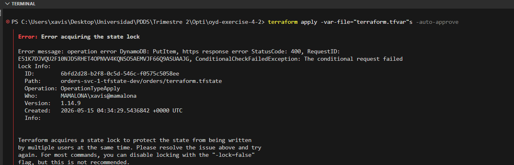

# oyd-exercise-4-2

## Evidence

`evidence/state-remote.txt` — resources tracked in the remote state:

```
aws_s3_bucket.order_attachments
```

`evidence/s3-state.txt` — state object listing in the backend bucket:

```
PS C:\Users\xavis\Desktop\Universidad\PDDS\Trimestre 2\Opti\oyd-exercise-4-2> aws s3 ls s3://orders-svc-1-tfstate-dev/orders/
2026-05-14 22:26:13       2929 terraform.tfstate
```

`evidence/lock-contention.png` — DynamoDB state-lock contention:


